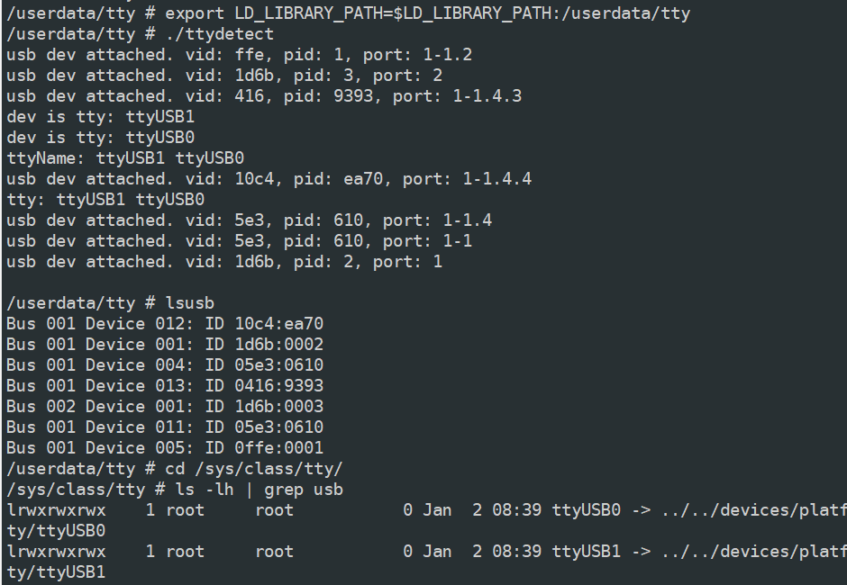

### 使用libusb自动获取usb串口设备名

#### 原理
tty设备会在/sys/class/tty目录下生成对应的设备名文件,该文件是一个软连接, 由于软连接路径中包含了usb的端口号，所以我们可以通过读取tty目录下文件的软链接查询某个usb端口的tty设备名。

```
/sys/class/tty # ls -lh
total 0
lrwxrwxrwx    1 root     root           0 Jan  2 05:56 console -> ../../devices/virtual/tty/console
lrwxrwxrwx    1 root     root           0 Jan  2 05:56 ptmx -> ../../devices/virtual/tty/ptmx
lrwxrwxrwx    1 root     root           0 Jan  2 05:56 tty -> ../../devices/virtual/tty/tty
lrwxrwxrwx    1 root     root           0 Jan  2 05:56 tty0 -> ../../devices/virtual/tty/tty0
lrwxrwxrwx    1 root     root           0 Jan  2 05:56 tty1 -> ../../devices/virtual/tty/tty1
lrwxrwxrwx    1 root     root           0 Jan  2 05:56 ttyAMA4 -> ../../devices/platform/soc/soc:amba/120a4000.uart/tty/ttyAMA4
...
lrwxrwxrwx    1 root     root           0 Jan  2 06:35 ttyUSB0 -> ../../devices/platform/soc/100e0000.xhci_0/usb1/1-1/1-1.4/1-1.4:1.0/ttyUSB0/tty/ttyUSB0
```

libusb提供了监听usb设备插拔检测的接口，可以获取到（已）插入设备的vid，pid和端口号，所以我们可以通过libusb提供的接口使用vid，pid，或者端口号方式获取usb tty设备名。当然，用了libusb可以直接其相关api去读写设备，不用走open方式，这里就不介绍。

代码比较简单，就没注释了。另外，libusb.so需要自己编译，我使用的是海思的编译工具（CROSS_COMPILE = arm-himix200-linux-），所以.so可能跟你的不一样，libusb如何编译自行搜索，这里就不介绍了。


调用usb_tty_detect_init注册回调即可监听usb tty设备，如果不是tty设备, ttyName将返回null。具体设备名需要自己根据vid pid或者端口号去判断usb设备名。

注意注册usb_arrived_callback时的flag要设置为LIBUSB_HOTPLUG_ENUMERATE，已插入的设备才会触发回调。

[](docs/usbttydetect.png)

如果设备有多个节点，设备名以空格隔开，“ttyUSB0 ttyUSB1"。
